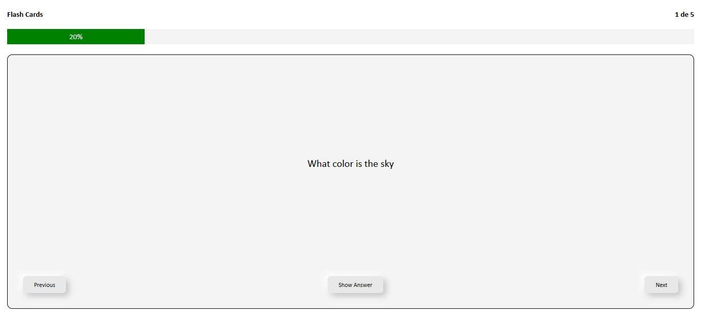

# Flash Cards App

**Project 8 - Frontend - Roadmap.sh**
🔗 [Project link on roadmap.sh](https://roadmap.sh/projects/flash-cards)

## 📄 Description

In this project, you will create a **flash card app** using **JavaScript frameworks**.
The app will contain pre-defined questions and answers that users can flip through to test their knowledge.

The main goal of this project is to help you practice **state management** and **component-based architecture** in JavaScript frameworks (such as React, Vue, or Angular).

## 📚 Project Goals

- Build a flash cards app with **pre-defined questions and answers**.
- Implement **state management** to handle navigation and progress tracking.
- Practice **component-based architecture** by structuring flashcards, progress bar, and navigation into reusable parts.
- Provide an interactive experience by allowing users to **flip cards** to reveal answers.
- Display a **progress bar** to show how many cards have been viewed.
- Ensure smooth **navigation** to cycle through flashcards one at a time.

## 📝 Requirements

Your app should include the following features:

- ✅ Pre-defined flashcards with **questions and answers**.
- ✅ A **progress bar** to show the user’s progress.
- ✅ Ability to **view one flashcard at a time** and flip it to reveal the answer.
- ✅ Simple **navigation controls** to move forward and backward through the flashcards.

## 🖼️ Results

